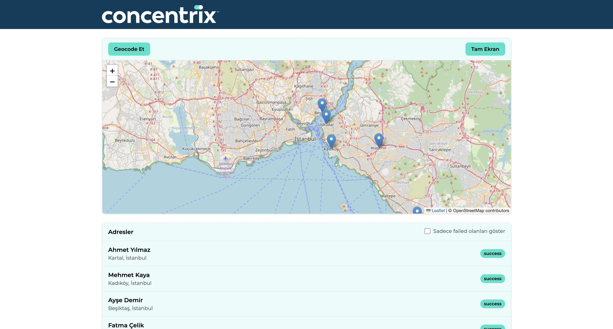
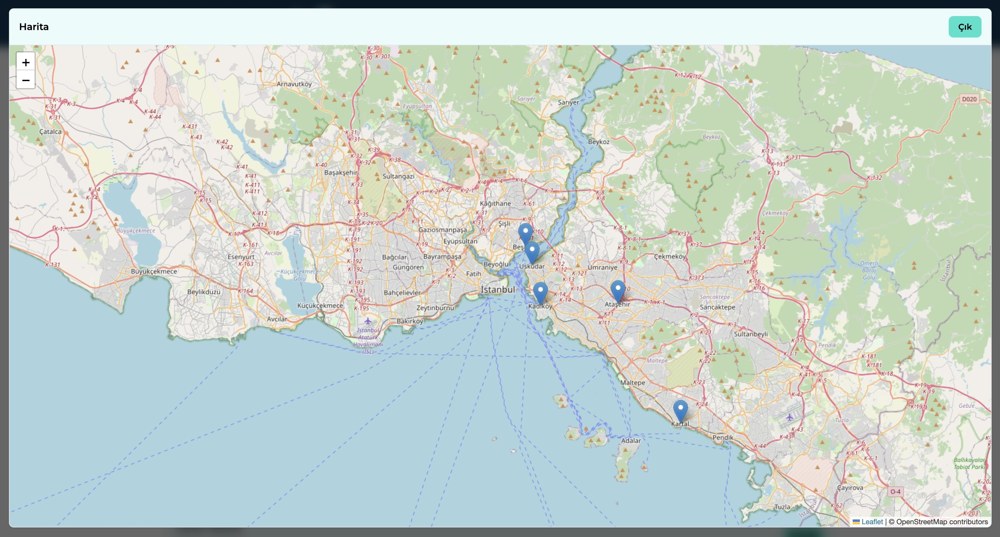
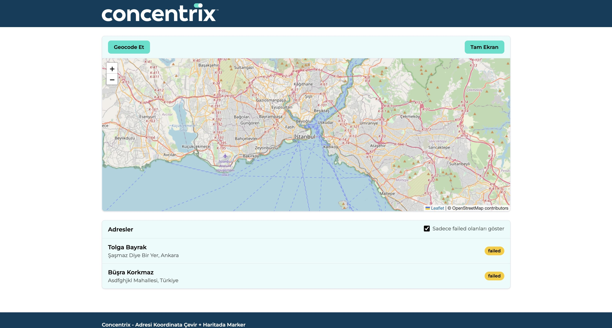
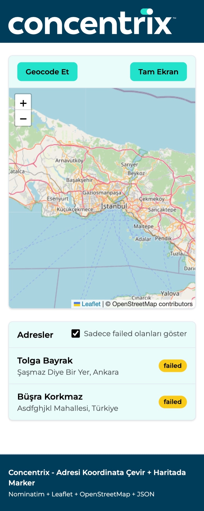

# PHP Görevi – Adresleri Geocode Edip Haritada Gösterme (Senaryo 2)

Bu proje, `data/address.json` içindeki adresleri OpenStreetMap/Nominatim üzerinden koordinata çevirir, sonuçları cache’ler ve haritada marker olarak gösterir.

## Teknolojiler

- PHP 8+
- OpenStreetMap Nominatim API (geocode için)

## Proje Mimarisi

### Controllers

- `src/Controllers/MapController`
  - Tüm adresleri geocode eder, marker ve durum listelerini hazırlar.
  - Cache sayesinde aynı adresler yeniden sorgulanmaz; başarısız olanlar ayrıca raporlanır.

### Services

- `src/Services/AddressService`
  - `data/address.json` dosyasını okur ve adresleri normalize eder.
- `src/Services/CacheService`
  - JSON dosyasında basit bir cache tutar; geocode sonuçlarını saklar ve tekrar kullanır.
- `src/Services/GeocodeService`
  - Nominatim API’yi çağırır, ilk sonucu alır ve lat/lng olarak döner.


## Çalıştırma

1. Gerekirse adresleri `data/address.json` içinde güncelleyin.
2. Uygulamayı başlatın:
   ```
   php -S localhost:8000 -t public
   ```
3. Tarayıcıdan `http://localhost:8000` adresine giderek haritayı ve marker’ları görüntüleyin.


## Notlar

- Geocode sonuçları cache dosyasına yazılır; aynı adres tekrar çağrıldığında API’ye istek atılmaz.
- Nominatim’in rate limit kurallarına uymak için istekler arası gecikme eklenmiştir.








