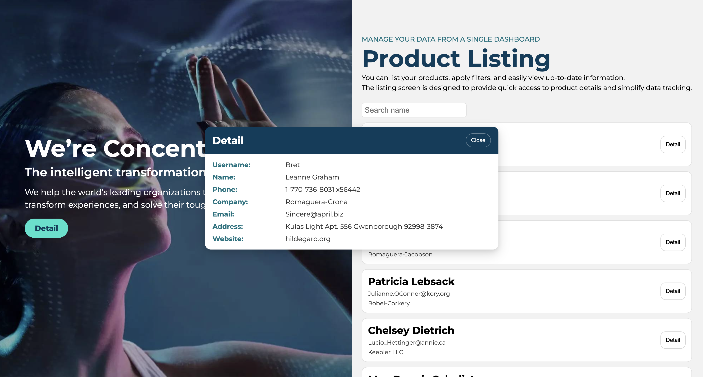

# React Görevi – Endpoint’ten Data Listeleme (Senaryo 3)

Bu proje, **React + Vite** kullanılarak geliştirilmiş olup bir API endpoint üzerinden kullanıcı verilerinin listelenmesini, isme göre aranması ve detaylarının görüntülenmesini amaçlamaktadır.

---

## Teknolojiler

- React
- Vite

---

## Proje Mimarisi

### Environment

- API adresi `.env` dosyasında tanımlıdır.
- `VITE_API_BASE_URL` değişkeni üzerinden endpoint bağlantısı sağlanır.

### Services

- `services/userServices.ts`
  - `/users` endpoint’i ile API bağlantısı kurulur.
  - Kullanıcı verilerinin çekilmesinden sorumludur.

### Models

- API’den dönen veriler TypeScript modelleri ile tanımlanmıştır.
- Tip güvenliği sağlanmıştır.

### Components

- **Banner**
  - Sayfanın sol alanında yer alır.
  - Şirket hakkında bilgilendirici içerik gösterir.
- **Table**
  - Kullanıcı listesinin tablo halinde gösterilmesini sağlar.
- **Modal**
  - Seçilen kullanıcının detay bilgilerini görüntüler.

### Pages

- **Home (`pages/Home`)**
  - Service, model ve component’leri bir araya getirir.
  - Kullanıcı listesini ve kullanıcı detaylarını ekranda gösterir.

---

## Kurulum

### 1. Environment Ayarları

.env.example dosyasını .env olarak yeniden adlandırın

### 2. Bağımlılıkları Yükleyin

npm install

### 3. Projeyi Çalıştırın

npm run dev

### 4. Uygulamayı Açın

http://localhost:5173

